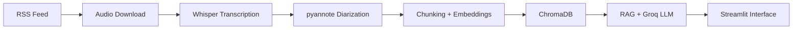

# 🎙️ Podcast Data Pipeline

> End-to-end RAG system over a podcast catalog — from RSS ingestion and
> Whisper transcription to semantic search with LLM-powered citations.


---

## What this project does

This project transforms a podcast catalog into a queryable knowledge base.
Audio episodes are downloaded, transcribed, diarized, chunked, and indexed
into a vector database. Users ask natural language questions through a web
interface and receive answers grounded in actual podcast content, with
source citations and timestamps.

Built around **NerdCast** (Brazilian Portuguese, 1052 episodes, 1734 hours)
but designed to be replicable for any podcast in any language.

---

## 🚀 MVP Available

The project is ready to run. Start the web interface:

```bash
streamlit run src/ui/app.py
```

Open `http://localhost:8501` and ask anything about the indexed episodes.
Pipeline status: **357 episodes indexed**, 29,180 searchable chunks.

---

## 🎙️ Use with your own podcast

The project intentionally isolates everything podcast-specific into
**configuration profiles**. Adapting to a different podcast doesn't require
modifying core code.

```python
# config/podcasts/your_podcast.py
PODCAST_NAME = "your_podcast"
LANGUAGE = "en"
RSS_URL = "https://your-podcast-feed.com/rss"
KNOWN_HOSTS = {...}
EXAMPLE_QUERIES = {...}
```

The project ships with profiles for Portuguese and English. Adding a new
language requires creating three small files (UI strings, prompts, regex
patterns) — all documented step-by-step.

📖 See [REPLICATION_GUIDE.md](docs/REPLICATION_GUIDE.md) for the complete
walkthrough.

---

## Architecture



For data flow details, dependencies between phases, and architectural
decisions, see [ARCHITECTURE.md](docs/ARCHITECTURE.md).

### Architectural Highlights

- **Modular phase design** — each phase is independent with its own
  validation, allowing iteration without blocking downstream phases
- **Idempotent pipelines** — re-running any phase produces consistent
  results, supporting incremental processing as new episodes are published
- **Source of truth separation** — SQLite holds canonical data, ChromaDB
  is rebuildable from it without data loss
- **Metadata-rich chunks** — every chunk carries episode, timestamp,
  speaker, and embedding ID for full traceability
- **Citation-first RAG** — system prompt enforces source attribution,
  reducing hallucination risk
- **Configuration-driven generalization** — podcast-specific behavior
  isolated in `config/podcasts/` profiles for easy replication
- **Local-first development** — full pipeline runs on a single laptop
  with a clear path to production migration documented in v2 backlog

---

## Project Status

| Phase | Status | Description |
|---|---|---|
| 1. Data Collection | ✅ Complete | 1052 episodes, 55.6GB, 1734h of audio |
| 2. Transcription | 🔄 In Progress | Whisper large-v3 with GPU, 357 done |
| 3. Diarization & Enrollment | ✅ Complete | pyannote 4.0 + speaker identification |
| 4. Chunking | ✅ Complete | Recursive chunking, 500 tokens, tiktoken |
| 5. Vector Indexing | ✅ Complete | ChromaDB, mpnet-base-v2, 768 dims |
| 6. RAG + LLM | ✅ Complete | Groq + Llama 3.3, 11-query evaluation suite |
| 7. Query Interface | ✅ Complete | Streamlit web app — **MVP delivered** |
| v2 Backlog | ⏳ Planned | Quality improvements, deployment, scaling |

---

## Tech Stack

### Core


### Data Ingestion


### Transcription


### Diarization


### Chunking


### Vector Indexing


### RAG & LLM


### Web Interface


### Development


---

## Getting Started

### Prerequisites

- Python 3.13
- NVIDIA GPU with 4GB+ VRAM (recommended)
- CUDA 12.x
- FFmpeg installed
- Free accounts on [HuggingFace](https://huggingface.co/) and [Groq](https://console.groq.com)

### Installation

```bash
# Clone the repository
git clone https://github.com/VTheStone/podcast-data-pipeline
cd podcast-data-pipeline

# Create and activate virtual environment
python -m venv venv
source venv/bin/activate  # Linux/Mac
# Windows: .\venv\Scripts\Activate.ps1

# Install dependencies
pip install -r requirements.txt

# Configure environment
cp .env.example .env
# Edit .env with your HF_TOKEN and GROQ_API_KEY
```

### Quick test

```bash
# Validate the configuration loads
python -c "from config import settings; print(settings.PODCAST_DISPLAY_NAME)"

# Start the web interface (uses existing indexed data)
streamlit run src/ui/app.py
```

For full pipeline execution from scratch, see
[REPLICATION_GUIDE.md](docs/REPLICATION_GUIDE.md).

---

## Usage Example

After indexing episodes, query the corpus interactively:

```bash
python -m src.rag.pipeline
```

Sample interaction:

Question: Which astronauts participated in Artemis II?
📝 Answer:
The astronauts who participated in the Artemis II mission are
Jeremy Hansen, Victor Glover, Christina Koch, and Reid Wiseman
[Excerpt 1, Ep: NerdCast 1026, 46:28].
📚 Sources (5 chunks):

NerdCast 1026 - Artemis II [46:28] (sim: 0.663)
NerdCast 1026 - Artemis II [30:26] (sim: 0.626)
NerdCast 1026 - Artemis II [10:09] (sim: 0.609)
...

---

## Documentation

Each phase has detailed documentation following a consistent structure:

| Phase | Final Report | Pipeline | Setup |
|---|---|---|---|
| 1. Data Collection | [📄](docs/phase1/final-report.md) | [📄](docs/phase1/pipeline.md) | [📄](docs/phase1/setup.md) |
| 2. Transcription | [📄](docs/phase2/final-report.md) | [📄](docs/phase2/pipeline.md) | [📄](docs/phase2/setup.md) |
| 3. Diarization | [📄](docs/phase3/final-report.md) | [📄](docs/phase3/pipeline.md) | [📄](docs/phase3/setup.md) |
| 4. Chunking | [📄](docs/phase4/final-report.md) | [📄](docs/phase4/pipeline.md) | [📄](docs/phase4/setup.md) |
| 5. Vector Indexing | [📄](docs/phase5/final-report.md) | [📄](docs/phase5/pipeline.md) | [📄](docs/phase5/setup.md) |
| 6. RAG + LLM | [📄](docs/phase6/final-report.md) | [📄](docs/phase6/pipeline.md) | [📄](docs/phase6/setup.md) |
| 7. Query Interface | [📄](docs/phase7/final-report.md) | [📄](docs/phase7/pipeline.md) | [📄](docs/phase7/setup.md) |

### Cross-cutting documentation

- [ARCHITECTURE.md](docs/ARCHITECTURE.md) — High-level system architecture
- [REPLICATION_GUIDE.md](docs/REPLICATION_GUIDE.md) — How to adapt for other podcasts
- [PIPELINE_ORCHESTRATION.md](docs/PIPELINE_ORCHESTRATION.md) — Execution dependencies and parallelization *(coming in Milestone 4)*

---

## Key Learnings

Project developed as a portfolio piece demonstrating:

- **Data Engineering** — idempotent pipelines, schema evolution with
  migrations, source-of-truth separation
- **MLOps** — ASR, speaker diarization, embeddings, RAG, evaluation suites
- **System Design** — phase modularity, configuration-driven generalization,
  observability via quality metrics
- **Best Practices** — semantic versioning, conventional commits, evidence-
  based documentation per phase, manual test checklists

---

## Project Layout

podcast-data-pipeline/
├── config/                  # Configuration profiles
│   ├── default.py           # Generic settings
│   └── podcasts/
│       ├── nerdcast.py      # NerdCast-specific
│       └── _template.py     # Template for new podcasts
├── data/                    # Local data (gitignored)
│   ├── raw/                 # Downloaded audio files
│   ├── metadata/            # SQLite database
│   └── chroma_db/           # Vector index
├── docs/
│   ├── _template/           # Documentation templates
│   ├── assets/              # Images and GIFs
│   ├── phase{1..7}/         # Per-phase documentation
│   ├── ARCHITECTURE.md
│   ├── REPLICATION_GUIDE.md
│   └── PIPELINE_ORCHESTRATION.md
├── migrations/              # Alembic database migrations
├── src/
│   ├── ingestion/           # Phase 1
│   ├── transcription/       # Phases 2 & 3
│   │   └── intro_patterns/  # Language-specific regex
│   ├── processing/          # Phases 4 & 5
│   ├── rag/                 # Phase 6
│   │   └── prompts/         # Language-specific prompts
│   └── ui/                  # Phase 7
│       └── translations/    # Language-specific UI strings
└── tests/
└── evaluation/          # Per-podcast evaluation suites

---

## License

MIT