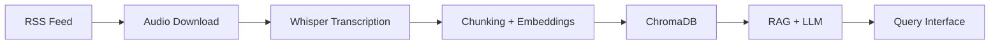

# 🎙️ Podcast Data Pipeline

> End-to-end pipeline for podcast audio ingestion, transcription, and semantic search
> using Whisper, ChromaDB and local LLMs.

## Architecture



## Stack

## Stack


## Project Status

| Phase | Status | Description |
|---|---|---|
| 1. Data Collection | ✅ Complete | 1052 episodes, 55.6GB, 1734h of audio |
| 2. Transcription | 🔄 In Progress | large-v3, GPU, ~208h processing time |
| 3. Diarization | ⏳ Planned | pyannote/audio |
| 4. Chunking | ⏳ Planned | LlamaIndex |
| 5. Vector Indexing | ⏳ Planned | ChromaDB |
| 6. RAG + LLM | ⏳ Planned | Ollama + llama3 |

## Getting Started

```bash
git clone https://github.com/VTheStone/podcast-data-pipeline
cd podcast-data-pipeline
python -m venv venv
source venv/bin/activate  # Windows: venv\Scripts\activate
pip install -r requirements.txt
cp .env.example .env
# Fill in your environment variables in .env
```

## Documentation

Each phase has detailed documentation in `/docs`:
- [Phase 1 — Data Collection](docs/phase1/)
  - [Data Source Mapping](docs/phase1/data-source.md)
  - [Environment Setup](docs/phase1/environment.md)
  - [Download Pipeline](docs/phase1/download-pipeline.md)
  - [Final Report](docs/phase1/final-report.md)
- [Phase 2 — Transcription](docs/phase2/)
  - [Whisper Setup](docs/phase2/whisper-setup.md)
  - [Final Report](docs/phase2/final-report.md)
- Phase 3 — Diarization *(planned)*
- Phase 4 — Chunking *(planned)*
- Phase 5 — Vector Indexing *(planned)*
- Phase 6 — RAG + LLM *(planned)*

## Key Learnings

Project developed with focus on:
- Data Engineering (pipelines, idempotency, orchestration)
- MLOps (ASR, embeddings, RAG)
- Best practices (versioning, documentation, testing)