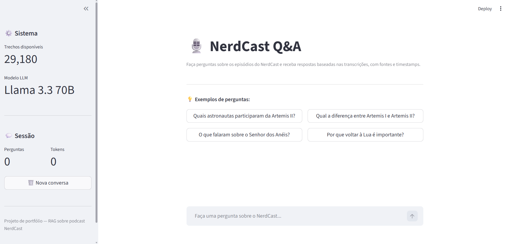
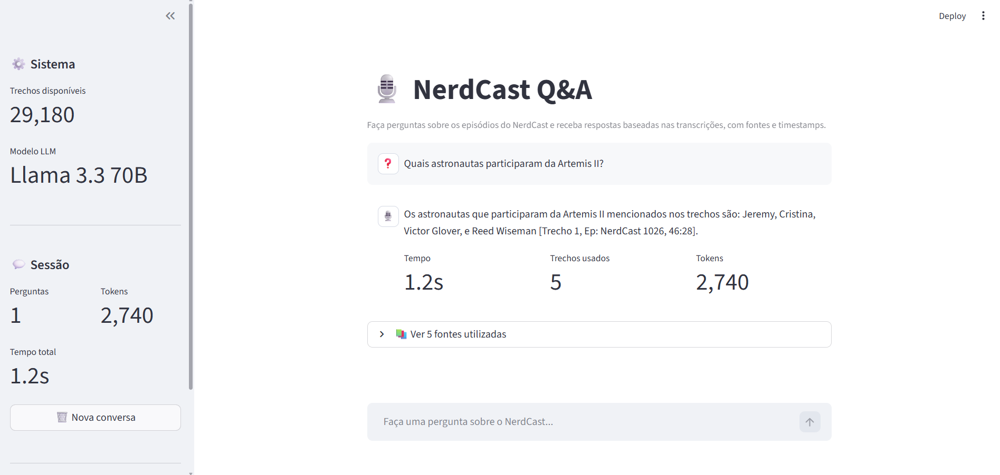
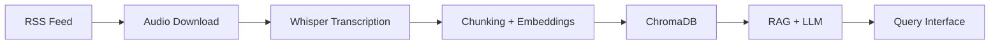

# 🎙️ Podcast Data Pipeline

> End-to-end pipeline for podcast audio ingestion, transcription, and semantic search
> using Whisper, ChromaDB and local LLMs.

## 🚀 MVP Available

The project is ready to use. Start the web interface:

```bash
streamlit run src/ui/app.py
```

Open `http://localhost:8501` and ask anything about the NerdCast podcast.




## Architecture


## Architectural Highlights

- **Modular phase design** — each phase is independent, with own validation, allowing iteration without blocking downstream
- **Idempotent pipelines** — re-running any phase produces consistent results, supporting incremental processing of new episodes
- **Source of truth separation** — SQLite holds canonical data, ChromaDB is rebuildable from it
- **Metadata-rich chunks** — every chunk carries episode, timestamp, speaker, and embedding ID for traceability
- **Citation-first RAG** — system prompt enforces source attribution, reducing hallucination risk
- **Local-first development** — full pipeline runs on a single laptop, with clear path to production migration documented in Phase 8

## Stack

### Core


### Data Ingestion


### Transcription


### Diarization


### Chunking


### Vector Indexing


### RAG & LLM


### Web Interface


### Development


| Phase | Status | Description |
|---|---|---|
| 1. Data Collection | ✅ Complete | 1052 episodes, 55.6GB, 1734h of audio |
| 2. Transcription | 🔄 In Progress | large-v3 with timestamps, GPU |
| 3. Diarization & Enrollment | ✅ Complete | pyannote 4.0 + speaker identification + alignment |
| 4. Chunking | ✅ Complete | Recursive chunking, 500 tokens, tiktoken |
| 5. Vector Indexing | ✅ Complete | ChromaDB, mpnet-base-v2, 768 dims |
| 6. RAG + LLM | ✅ Complete | Groq + llama-3.3-70b, evaluation suite |
| 7. Query Interface | ✅ Complete | Streamlit web app — MVP delivered |
| 8. Identification Optimization | ⏳ Planned | Quality + infrastructure + deployment |

## Getting Started

```bash
git clone https://github.com/VTheStone/podcast-data-pipeline
cd podcast-data-pipeline
python -m venv venv
source venv/bin/activate  # Windows: venv\Scripts\activate
pip install -r requirements.txt
cp .env.example .env
# Fill in your environment variables in .env
```

## Documentation

Each phase has detailed documentation in `/docs`:
- [Phase 1 — Data Collection](docs/phase1/)
  - [Data Source Mapping](docs/phase1/data-source.md)
  - [Environment Setup](docs/phase1/environment.md)
  - [Download Pipeline](docs/phase1/download-pipeline.md)
  - [Final Report](docs/phase1/final-report.md)
- [Phase 2 — Transcription](docs/phase2/)
  - [Whisper Setup](docs/phase2/whisper-setup.md)
  - [Final Report](docs/phase2/final-report.md)
- Phase 3 — Diarization *(planned)*
- Phase 4 — Chunking *(planned)*
- Phase 5 — Vector Indexing *(planned)*
- Phase 6 — RAG + LLM *(planned)*

## Key Learnings

Project developed with focus on:
- Data Engineering (pipelines, idempotency, orchestration)
- MLOps (ASR, embeddings, RAG)
- Best practices (versioning, documentation, testing)

## Usage Example

After indexing episodes, query the corpus interactively:

```bash
python -m src.rag.pipeline
```

Sample interaction:

```
Pergunta: Quais astronautas participaram da Artemis II?

📝 Resposta:
Os astronautas que participaram da missão Artemis II são: Jeremy,
Victor Glover, Cristina e Reed Wiseman [Trecho 1, Ep: NerdCast 1026, 46:28].

📚 Fontes (5 trechos):
  - NerdCast 1026 - Artemis II [46:28] (sim: 0.663)
  ...
```