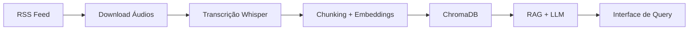

# Podcast Data Pipeline

> Pipeline completo de ingestão, transcrição e busca semântica de episódios de podcast,
> utilizando Whisper, ChromaDB e LLMs locais.

## Arquitetura



## Stack


## Status do Projeto

| Fase | Status | Descrição |
|---|---|---|
| 1. Coleta de Dados | ⏳ Em andamento | Ingestão via RSS feed |
| 2. Transcrição | ⏳ Planejado | faster-whisper |
| 3. Diarização | ⏳ Planejado | pyannote/audio |
| 4. Chunking | ⏳ Planejado | LlamaIndex |
| 5. Indexação Vetorial | ⏳ Planejado | ChromaDB |
| 6. RAG + LLM | ⏳ Planejado | Ollama + llama3 |

## Como Rodar

```bash
git clone https://github.com/seu-usuario/podcast-data-pipeline
cd podcast-data-pipeline
python -m venv venv
source venv/bin/activate
pip install -r requirements.txt
cp .env.example .env
# Preencha o .env com suas variáveis
```

## Documentação

Cada fase tem documentação detalhada em `/docs`:
- [Fase 1 — Coleta de Dados](docs/fase1/)

## Aprendizados Técnicos

Projeto desenvolvido com foco em aprendizado de:
- Data Engineering (pipelines, idempotência, orquestração)
- MLOps (ASR, embeddings, RAG)
- Boas práticas (versionamento, documentação, testes)