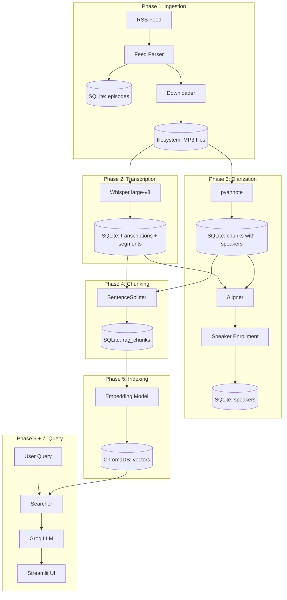

# Architecture

This document describes how the podcast data pipeline works as a system —
the relationships between phases, storage strategy, configuration model,
and key architectural decisions.

For per-phase details, see `docs/phaseN/`. For replication instructions,
see [REPLICATION_GUIDE.md](./REPLICATION_GUIDE.md).

---

## System Overview

The system is a 7-phase pipeline that transforms a podcast RSS feed into
a queryable knowledge base. Each phase consumes the output of previous
phases and produces inputs for the next.



### What's inside the system

- Audio download and storage
- Speech-to-text transcription
- Speaker diarization and identification
- Text chunking and embedding generation
- Vector indexing and semantic search
- LLM-powered response synthesis
- Web interface for end users

### What's outside the system

- The RSS feed itself (third-party, may change format)
- The HuggingFace models (downloaded once, not maintained by this project)
- The Groq API (external dependency for LLM inference)
- The user's browser (rendering the Streamlit UI)

---

## Data Flow

Data flows through three storage layers, each with a specific purpose:

```

┌────────────────────────────────────────────────────────────┐
│  Filesystem                                                 │
│  data/raw/.mp3                  ← downloaded audio        │
│  data/transcripts/.json         ← debug snapshots         │
│  data/metadata/catalog.json      ← human-readable backup   │
└────────────────────────────────────────────────────────────┘
┌────────────────────────────────────────────────────────────┐
│  SQLite (source of truth)                                   │
│  episodes                        ← catalog with flags      │
│  transcriptions                  ← full text + metrics     │
│  transcription_segments          ← timestamped segments    │
│  chunks                          ← diarization output      │
│  speakers                        ← identified speakers     │
│  rag_chunks                      ← RAG-ready chunks        │
└────────────────────────────────────────────────────────────┘
┌────────────────────────────────────────────────────────────┐
│  ChromaDB (search index)                                    │
│  podcast_chunks collection       ← embeddings + metadata   │
└────────────────────────────────────────────────────────────┘

```

A user query traverses these layers in reverse:

1. Query embedded by the same model used for indexing (Phase 5)
2. ChromaDB returns top-K chunk IDs with similarity scores
3. SQLite resolves chunk IDs to text, episode metadata, and timestamps
4. Filesystem isn't touched during query — only at index time

---

## Storage Strategy

### Why three storage layers?

Each layer has different strengths and limitations:

**Filesystem** — best for binary data (audio files)
- Trade-off: not queryable, not transactional
- Used for: raw MP3 files, debug snapshots, catalog backup

**SQLite** — best for structured relational data
- Trade-off: not optimized for vector similarity search
- Used for: source of truth — all canonical metadata, transcriptions,
  speakers, and pipeline state

**ChromaDB** — best for high-dimensional similarity search
- Trade-off: not designed for arbitrary queries, no joins
- Used for: vector embeddings with attached metadata for filtering

### What's canonical vs derived

- **Canonical**: SQLite tables and downloaded MP3 files. Everything else
  can be regenerated.
- **Derived**: ChromaDB embeddings (regenerable from SQLite chunks),
  catalog.json (regenerable from episodes table), transcript JSON files
  (debug only).

This separation enables a critical operation: **rebuilding ChromaDB
from scratch** without re-running expensive phases. If we want to A/B
test a new embedding model, we re-run Phase 5 only, with SQLite
unchanged.

### Pipeline progress tracking

Each `episodes` row has boolean flags marking which phases have
completed:

```python
class Episode:
    downloaded: bool
    transcribed: bool
    diarized: bool
    chunked: bool
    indexed: bool
```

Every pipeline phase filters by these flags, making the system fully
idempotent and resumable. If transcription fails on episode 247, the
next run picks up exactly where it stopped.

---

## Phase Dependencies

The phases form a directed acyclic graph (DAG) with two types of edges:

### Sequential dependencies (data flow)

```

Phase 1 (Download) → Phase 2 (Transcribe) → Phase 4 (Chunk) → Phase 5 (Index)
→ Phase 3 (Diarize) ────┘

```

A phase cannot start without its predecessors completing for the given
episode. Phase 4 needs both transcription text and diarization
boundaries, so it waits for both Phases 2 and 3.

### Hardware contention (GPU)

```

Phase 2 (Whisper)      ─┐
Phase 3 (pyannote)      ├─ All require GPU, cannot run simultaneously
Phase 5 (embeddings)   ─┘
Phase 4 (chunking)        Pure CPU, can run in parallel with any GPU phase

```

The GPU has 4GB VRAM, which fits one model at a time. Running multiple
GPU phases concurrently causes OOM. The pipeline orchestration
(documented in [PIPELINE_ORCHESTRATION.md](./PIPELINE_ORCHESTRATION.md))
serializes GPU phases while allowing Phase 4 to run in parallel.

### Default execution order

For maximum throughput with GPU constraints:

Step 1: Phase 1 (downloads happen in parallel via network, no GPU)
Step 2: Phase 2 (Whisper, GPU sequential)
Step 3: Phase 3 + Phase 4 (pyannote on GPU, chunking on CPU, parallel)
Step 4: Phase 5 (embeddings, GPU)
Step 5: Phase 6 + 7 (on-demand per query, GPU + network)

---

## Configuration Architecture

The system uses a three-tier configuration model:

```

┌──────────────────────────────────────────────────────────┐
│  Layer 1: config/default.py                              │
│  Generic, podcast-agnostic settings                       │
│  - chunk_size, embedding_dimensions                       │
│  - distance_metric, RAG thresholds                        │
└──────────────────────────────────────────────────────────┘
↑ overridden by
┌──────────────────────────────────────────────────────────┐
│  Layer 2: config/podcasts/{profile}.py                   │
│  Podcast-specific values                                  │
│  - RSS_URL, PODCAST_NAME, LANGUAGE                        │
│  - WHISPER_INITIAL_PROMPT, KNOWN_HOSTS                    │
│  - EXAMPLE_QUERIES, EMBEDDING_MODEL choice                │
└──────────────────────────────────────────────────────────┘
↑ selects
┌──────────────────────────────────────────────────────────┐
│  Layer 3: Language modules (selected via LANGUAGE)        │
│  - src/rag/prompts/{lang}.py                              │
│  - src/ui/translations/{lang}.py                          │
│  - src/transcription/intro_patterns/{lang}.py             │
└──────────────────────────────────────────────────────────┘

```

### How it works at runtime

```python
# config/__init__.py loads the right combination
profile = os.getenv("PODCAST_PROFILE", "nerdcast")
defaults = import_module("config.default")
podcast = import_module(f"config.podcasts.{profile}")
settings = Settings(defaults, podcast)

# Anywhere in the codebase:
from config import settings
print(settings.RSS_URL)         # from podcast profile
print(settings.CHUNK_SIZE)      # from defaults
```

Language-specific modules are loaded lazily — at the point where the
prompts/translations/patterns are first accessed — using
`settings.LANGUAGE` as the key.

### Why this architecture

The motivation: make the system replicable for any podcast in any
language without touching core code.

- **Adding a new podcast**: create one file in `config/podcasts/`
- **Adding a new language**: create three files in `src/.../*/`
- **Tuning a generic parameter**: edit `config/default.py` (applies
  to all podcasts)

This separation also makes the codebase easier to reason about: if you
see a string hardcoded in `src/`, that's a bug — strings live in
language modules, configuration lives in `config/`.

---

## Error Handling and Idempotency

### Idempotency by design

Every phase is idempotent: re-running it produces the same result without
duplicating work. This is achieved through:

1. **Database flag checks** at the start of every phase
```python
   episodes = session.query(Episode).filter(
       Episode.transcribed == False
   ).all()
```

2. **Existence checks** before expensive operations
```python
   if file_already_exists(audio_path):
       continue
```

3. **Transactional database writes** — partial writes don't leave the
   system in a corrupt state

### Failure recovery

When a phase fails for an episode:

- The episode's flag is NOT set to True
- Other episodes continue processing (no fail-fast)
- The next run automatically retries failed episodes
- Errors are logged with episode IDs for debugging

This makes the pipeline robust to flaky failures (network issues,
transient GPU OOM, etc.) without manual intervention.

### Partial file cleanup

For downloads, the system removes partial files on failure to prevent
corrupted audio from passing later validation. The `validator.py` of
each phase performs sanity checks before marking work as complete.

---

## Observability

### Logging strategy

The project uses `loguru` for structured logging across all phases.
Key conventions:

- **INFO** for normal progress (e.g., "Processing 5/1052 episodes")
- **SUCCESS** for completed milestones
- **WARNING** for recoverable issues (e.g., "Speaker collision detected")
- **ERROR** for failures that skip an episode but don't crash the pipeline

Log output goes to stdout, easy to redirect to file or pipe to a log
aggregator in production.

### Quality metrics

Each phase produces metrics that feed into validators:

| Phase | Key metrics |
|---|---|
| 1. Ingestion | episodes_parsed, missing_audio_url, missing_duration |
| 2. Transcription | avg_logprob, repetition_rate, chars_per_minute, hallucination_flag |
| 3. Diarization | num_speakers, alignment_rate, identified_speakers |
| 4. Chunking | avg_tokens, oversized_chunks, undersized_chunks |
| 5. Indexing | total_indexed, sql_chroma_sync_count |
| 6. RAG | evaluation_score, avg_response_time, avg_tokens_per_query |

These metrics are logged at the end of each phase and stored in the
database where applicable. The validators (`*_validator.py`) provide
on-demand quality reports.

### Validators as checkpoints

Each phase has a validator script that can be run independently:

```bash
python -m src.transcription.validator
python -m src.processing.indexing_validator
```

These are useful for:

- Verifying a phase completed correctly after a long run
- Spot-checking data integrity before proceeding to the next phase
- CI/CD integration in v2 (not yet implemented)

---

## Key Architectural Decisions

The most important decisions, summarized. Each links to the phase
documentation where it's fully discussed.

| Decision | Rationale | Documented in |
|---|---|---|
| SQLite as source of truth | Single-file, queryable, no server, fits MVP scale | [Phase 1 setup](./phase1/setup.md) |
| ChromaDB embedded for vectors | Zero-config, native HNSW, file-based persistence | [Phase 5 setup](./phase5/setup.md) |
| Whisper large-v3 over medium | Better coverage and proper noun accuracy outweighs speed | [Phase 2 setup](./phase2/setup.md) |
| pyannote 4.x with soundfile | Bypasses torchcodec/FFmpeg incompatibilities on Windows | [Phase 3 setup](./phase3/setup.md) |
| Recursive chunking with overlap | Predictable size, semantic boundaries, no embedding overhead | [Phase 4 final-report](./phase4/final-report.md) |
| Multilingual mpnet for embeddings | Works in 50+ languages, fits 4GB VRAM | [Phase 5 final-report](./phase5/final-report.md) |
| Groq + Llama 3.3 70B for LLM | Free tier, fast inference, quality comparable to GPT-4 | [Phase 6 setup](./phase6/setup.md) |
| Streamlit over Flask/React | Fastest time-to-MVP, recognized in ML community | [Phase 7 setup](./phase7/setup.md) |
| Configuration-driven generalization | Enables replication for any podcast/language | This document |

---

## Future Architecture (v2)

The current architecture is optimized for **single-machine MVP**. Several
constraints will need to change for production deployment.

### Storage scaling

Current: SQLite + ChromaDB embedded (single-process)
v2:      PostgreSQL + Qdrant/Weaviate (hosted, multi-process safe)

SQLite handles ~1000 episodes well but doesn't support concurrent
writers. ChromaDB embedded has the same limitation. Both need to be
swapped for hosted alternatives before deploying a public-facing app.

### Compute scaling

Current: Single GPU laptop, all phases run sequentially
v2:      Cloud GPU instances for batch phases, lightweight nodes for query

The current setup processes ~12 minutes per episode for transcription.
Cloud GPUs (H100, A100) reduce this to ~2 minutes, enabling daily
ingestion of new episodes at scale.

### Deployment

Current: streamlit run local
v2:      Containerized (Docker) + hosted (Streamlit Cloud, HF Spaces,
or AWS/GCP)

Deployment also requires migrating ChromaDB to a hosted vector DB
since Streamlit Cloud has limited persistent storage.

### Quality improvements

The v2 backlog (in `docs/phase8/`) tracks specific quality improvements
identified during MVP evaluation:

- Adaptive top-K for quantitative queries
- Named entity recognition for proper noun matching
- Cross-encoder re-ranking
- Speaker name resolution in chunks
- Cross-episode embedding consolidation for speakers

These don't require architectural changes — they're enhancements to
existing components.