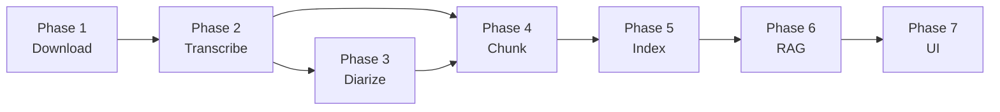

# Pipeline Orchestration

This document describes how the project orchestrates the execution of
its 7-phase pipeline, balancing data dependencies, hardware constraints,
and parallelization opportunities.

For an overview of what each phase does, see [ARCHITECTURE.md](./ARCHITECTURE.md).
For replicating the pipeline on a new podcast, see
[REPLICATION_GUIDE.md](./REPLICATION_GUIDE.md).

---

## Dependency Analysis

### Data dependencies

A phase cannot start until its input data is produced by previous phases.
The hard data dependencies between phases:



Key observations:

- **Phase 4 depends on both Phase 2 and Phase 3** — chunks need
  transcribed text and speaker boundaries
- **Phase 6 and Phase 7 are on-demand** — they don't process the
  catalog in batch; they respond to user queries
- **Within each phase, episodes are independent** — Phase 2 can
  transcribe episode 5 and episode 10 in any order

### Resource constraints

The local development environment has limited resources that constrain
how phases can run simultaneously:

| Phase | Resource | Notes |
|---|---|---|
| 1. Download | Network I/O | No GPU/CPU bottleneck |
| 2. Transcribe | GPU (Whisper) | ~3.5GB VRAM with int8_float16 |
| 3. Diarize | GPU (pyannote) | ~2GB VRAM |
| 4. Chunk | CPU only | No GPU usage |
| 5. Index | GPU (embeddings) | ~1.5GB VRAM |
| 6. RAG | Network (Groq) | Embedding model loaded |
| 7. UI | CPU + Network | Wraps Phase 6 |

The development GPU (RTX 3050 Ti, 4GB VRAM) can only fit one model at a
time. **No two GPU phases can run concurrently** on this hardware.

### Parallelization opportunities

Combining data dependencies with resource constraints:

GPU-bound phases (must serialize):  Phase 2, Phase 3, Phase 5
CPU-bound phases (can parallelize): Phase 1 (network), Phase 4 (compute)

This creates these valid parallelization patterns:

1. **Phase 1 + any other phase** — downloads are network-bound, don't
   compete with GPU operations
2. **Phase 3 + Phase 4** — diarization (GPU) and chunking (CPU) can run
   together for episodes that already have transcription
3. **Phase 4 + Phase 5** — chunking (CPU) and indexing (GPU) can overlap

The pipeline orchestrator implements these patterns automatically when
beneficial.

---

## Execution Plan

### Default execution order (greedy)

The default mode runs all phases for all pending episodes, optimizing
for throughput:

```

Step 1: Phase 1 (download)
├─ All episodes not downloaded yet
└─ Network-bound, can run concurrently
Step 2: Phase 2 (transcribe)
├─ All episodes downloaded but not transcribed
└─ GPU-bound, sequential per episode
Step 3: Phase 3 + Phase 4 in parallel
├─ Phase 3: episodes transcribed but not diarized (GPU)
└─ Phase 4: episodes ready for chunking (CPU)
Step 4: Phase 5 (index)
├─ All episodes chunked but not indexed
└─ GPU-bound, sequential per episode
Step 6 & 7: On-demand (not batch)
└─ Triggered by user queries via Streamlit

```

### Estimated total time

For the full NerdCast dataset (1052 episodes) on the development hardware:

| Phase | Per-episode time | Total time | Bottleneck |
|---|---|---|---|
| 1. Download | ~30s | ~9h | Network |
| 2. Transcribe | ~12 min | ~210h | GPU |
| 3. Diarize | ~6 min | ~105h | GPU |
| 4. Chunk | <1s | ~15 min | CPU |
| 5. Index | ~1.3s | ~25 min | GPU |
| **Total (sequential)** | | **~325h** | |
| **Total (with parallelization)** | | **~220h** | |

Parallelization reduces wall-clock time by ~30% by overlapping Phase 4
with Phases 3 and 5.

### Idempotency

Every phase is idempotent — re-running the orchestrator skips episodes
that have already completed each step. This is enforced via boolean
flags in the `episodes` table:

```python
episodes.downloaded
episodes.transcribed
episodes.diarized
episodes.chunked
episodes.indexed
```

A phase only processes episodes where its corresponding flag is `False`.
On completion, the flag is set to `True`, persisting the progress.

### Failure recovery

When a phase fails for a specific episode:

- The episode's flag is NOT set to `True`
- The orchestrator logs the error and continues to the next episode
- Other phases proceed normally with already-processed episodes
- The next orchestrator run automatically retries failed episodes

This makes the pipeline resilient to transient failures (network
issues, transient GPU OOM, hallucinated transcriptions) without manual
intervention.

---

## Trade-offs Considered

### Why a custom Python orchestrator instead of Airflow/Prefect?

The custom orchestrator (~200 lines of Python) was chosen to demonstrate
understanding of orchestration fundamentals without taking on the
operational complexity of a full DAG framework.

Trade-offs accepted:

- **No web UI** — progress visible via stdout and log files
- **No scheduler** — pipeline runs on-demand, not on a schedule
- **No distributed execution** — single-machine only
- **No declarative DAG syntax** — dependencies are implicit in the code

Trade-offs gained:

- **Zero external infrastructure** — no Postgres, no scheduler service
- **Full visibility** — every line of orchestration logic is in the repo
- **Easy to extend** — adding new phases or paths is straightforward

Migration to Apache Airflow is on the v2 backlog (see
[docs/phase8/overview.md](./phase8/overview.md)). For v2, the
orchestration translates cleanly to Airflow tasks with `>>` dependencies.

### Why not run all phases in parallel?

In theory, episodes are independent, so all phases could run as a streaming
pipeline (Phase 2 starts emitting transcripts as Phase 1 finishes individual
episodes, Phase 3 starts as Phase 2 emits, etc.).

This was not implemented because:

- **GPU contention** would force serialization anyway between Phases 2, 3, 5
- **Streaming complexity** doesn't justify the marginal speedup
- **Debugging difficulty** — failures harder to isolate in streaming pipelines
- **Batch nature of the use case** — initial ingestion happens once

If new episodes are added regularly, a streaming approach makes more sense
and is part of the v2 considerations.

### Why not split GPU and CPU phases across machines?

For production, separating GPU phases (transcription, diarization,
indexing) onto a dedicated GPU instance while running CPU phases
(chunking) on a cheap CPU instance would optimize cost.

For an MVP single-machine setup, this adds operational complexity
without throughput gains. It's part of the v2 deployment architecture
plan.

---

## Phase-Specific Notes

### Phase 1 — Download

The downloader uses `requests.get(stream=True)` for memory efficiency.
For very large podcast catalogs, downloads can be parallelized across
multiple connections without GPU contention.

Network is rarely the bottleneck on broadband connections (~1GB/s
shared with other workloads is typical).

### Phase 2 — Transcribe

Whisper large-v3 with int8_float16 quantization uses ~3.5GB VRAM,
leaving little room for other GPU workloads. This is the longest
phase by far (~12 min per episode).

Per-episode failures are most common in this phase due to:
- Episodes with mostly music (hallucination loops)
- Episodes with unusual audio encoding
- Transient CUDA OOM under VRAM pressure

The orchestrator catches these and marks them for retry.

### Phase 3 — Diarize

pyannote 4.x with the soundfile workaround uses ~2GB VRAM. Runs after
Phase 2 because the alignment sub-pipeline cross-references with
transcription segments.

Phase 3 has three sub-pipelines (diarization, alignment, enrollment)
that run sequentially within the phase. See
[docs/phase3/pipeline.md](./phase3/pipeline.md).

### Phase 4 — Chunk

Pure CPU. Runs in well under a second per episode. The orchestrator
takes advantage of this to overlap with Phase 3 or Phase 5.

### Phase 5 — Index

Loads the multilingual mpnet model (~1.1GB VRAM) and batches chunks
in groups of 32 for embedding generation. Runs after Phase 4.

ChromaDB writes are transactional — failures don't leave the index
in a corrupt state.

---

## Status Reporting

The orchestrator provides a dashboard at the start and after each phase:

```

╔════════════════════════════════════════════════════════════════╗
║              PIPELINE ORCHESTRATION STATUS                      ║
╠════════════════════════════════════════════════════════════════╣
║  Podcast: NerdCast                                              ║
║  Started: 2026-05-12 14:32:01                                   ║
║  Elapsed: 02:14:36                                              ║
╠════════════════════════════════════════════════════════════════╣
║  Phase                  Pending    Done    Failed   Status      ║
║  1. Download              0/1052   1052      0      ✅ Complete  ║
║  2. Transcribe          245/1052    807      0      🔄 Running   ║
║  3. Diarize             456/1052    596      0      ⏸  Waiting   ║
║  4. Chunk                 0/596     596      0      ✅ Complete  ║
║  5. Index                 0/596     596      0      ✅ Complete  ║
╠════════════════════════════════════════════════════════════════╣
║  GPU: NVIDIA RTX 3050 Ti  |  VRAM: 3.2/4.0 GB  |  Util: 87%     ║
║  ETA: ~46h remaining (Phase 2 bottleneck)                       ║
╚════════════════════════════════════════════════════════════════╝

```

The dashboard refreshes after each phase completes for an episode,
giving real-time visibility without log spam.

Detailed per-episode logs are written to `logs/pipeline_{timestamp}.log`
for post-mortem analysis.