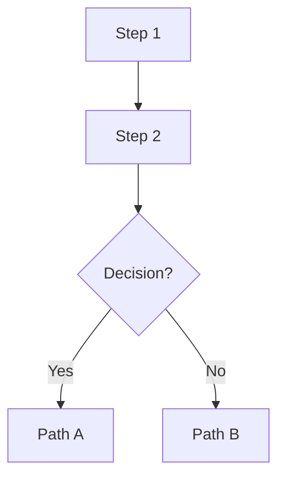

# {Phase Name} Pipeline

## Overview

{2-3 sentence description of what this pipeline does, its inputs and outputs.
Mention idempotency if applicable.}

## Flow

{Mermaid flowchart showing the main steps. Use this format:}



## Components

{Brief description of each component file in this phase and what it does.}

| File | Responsibility |
|---|---|
| `src/path/to/file.py` | What it does |

## Key Design Decisions

{Architectural choices made and why. Include trade-offs considered.}

- **Decision name:** What was decided and the rationale
- **Decision name:** What was decided and the rationale

## Configuration

{What is podcast-specific or language-specific in this pipeline.}

| Parameter | Default Value | Where to configure |
|---|---|---|
| `PARAM_NAME` | value | `config/podcasts/{name}.py` |

See [REPLICATION_GUIDE.md](../REPLICATION_GUIDE.md) for adapting to a different podcast.

## Language Considerations

{What changes when adapting this pipeline to a different language.
Be specific about:}

- Libraries that may not support all languages
- Models that need to be swapped
- Patterns or rules that are language-specific
- Tokenizers or text processing that varies

## Output

{Description of what this pipeline produces — database tables modified,
files created, etc. This is the input format for the next phase.}

## Running

```bash
# Test mode (small batch)
python -c "from src.module import run; run(max_episodes=N)"

# Full run
python -m src.module
```

## Troubleshooting

{Common issues and solutions specific to this pipeline.}