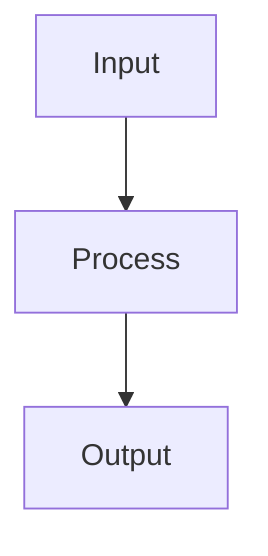

# {Subpipeline Name} — {Phase} Subpipeline

## Purpose

{What this specific subpipeline does within the broader phase.
Why it exists as a separate step.}

## Position in Phase

{Where this subpipeline fits in the phase flow.}


## Strategy

{The approach taken. Algorithm, heuristic, or technique.}

## Flow



## Key Design Decisions

- **Decision:** Rationale and trade-offs

## Configuration

{Parameters that may need tuning per podcast or language.}

| Parameter | Default | Notes |
|---|---|---|

## Language Considerations

{What is language-specific in this subpipeline.}

## Output

{What this subpipeline produces.}

## Known Limitations

- Limitation 1
- Limitation 2

## Running

```bash
python -c "from src.module import run; run(max_episodes=N)"
```