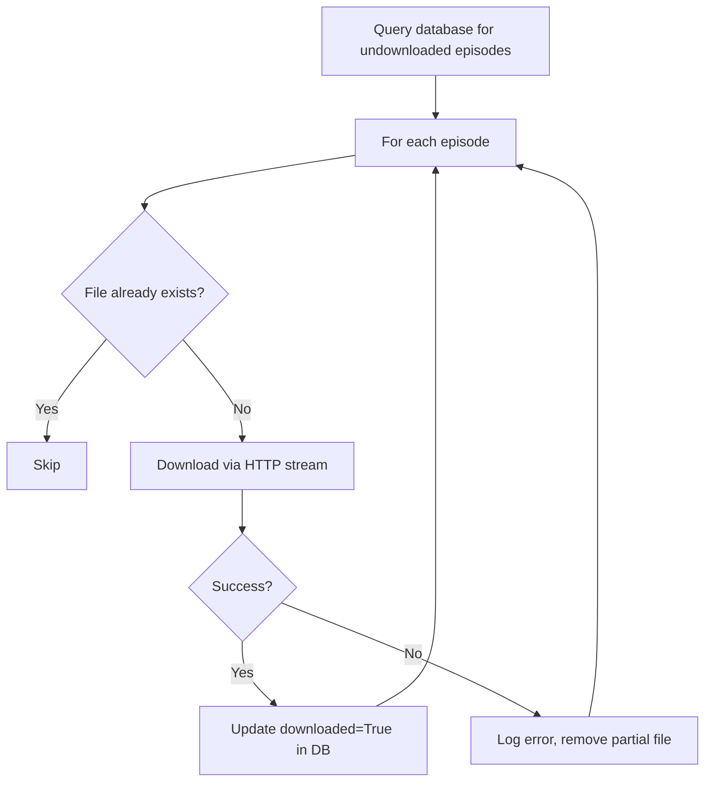

# Download Pipeline

## Overview

Downloads MP3 audio files from episode URLs stored in the database.
Idempotent: episodes already downloaded are skipped based on database flag.

## Flow



## Key Design Decisions

- **Streaming download:** Uses `stream=True` to avoid loading entire file in memory
- **Idempotency:** Checks both file existence and database flag
- **Partial file cleanup:** Removes incomplete files on failure to avoid corrupt audio
- **Batch progress:** Logs summary every N episodes for observability
- **max_episodes param:** Allows testing with small batches before full run

## Running

```bash
# Test with 3 episodes
python -c "from src.ingestion.downloader import run; run(max_episodes=3)"

# Download all episodes
python -m src.ingestion.downloader
```