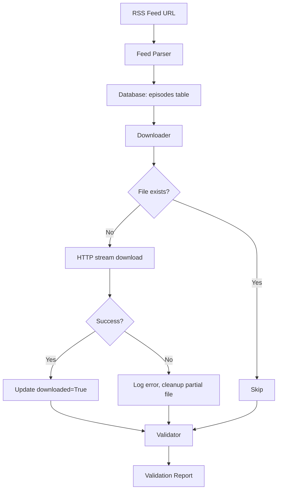

# Phase 1 Pipeline

## Overview

Phase 1 ingests the podcast catalog from RSS, downloads all audio files,
and validates the resulting dataset. The pipeline is idempotent — re-running
any step skips already-processed items based on database flags.

## Flow



## Components

| File | Responsibility |
|---|---|
| `src/ingestion/feed_parser.py` | Parse RSS feed and populate episodes table |
| `src/ingestion/downloader.py` | Download MP3 files for episodes |
| `src/ingestion/validator.py` | Verify catalog integrity and download completeness |
| `src/ingestion/database.py` | SQLAlchemy schema definitions |

## Key Design Decisions

- **Streaming downloads:** Uses `stream=True` in requests to avoid loading
  large files into memory. Critical for episodes over 1GB.
- **Two-source description:** Falls back from `content[0].value` to `summary`
  to handle inconsistent feed publishing conventions.
- **Partial file cleanup:** Removes incomplete files on download failure to
  prevent corrupted audio from passing validation.
- **Batch progress logging:** Emits summary every N episodes for observability
  during long downloads.

## Configuration

| Parameter | Default | Where to configure |
|---|---|---|
| `RSS_URL` | NerdCast feed | `config/podcasts/{name}.py` |
| `PODCAST_NAME` | nerdcast | `config/podcasts/{name}.py` |
| `AUDIO_DIR` | `data/raw/` | `src/ingestion/config.py` |

See [REPLICATION_GUIDE.md](../REPLICATION_GUIDE.md) for adapting to a different
podcast.

## Language Considerations

This pipeline is language-agnostic. Operates on metadata and binary audio
regardless of the podcast's spoken language.

The only consideration is **encoding**: RSS feeds should use UTF-8 for titles
and descriptions, but some legacy feeds may use Latin-1 or other encodings.
The parser handles this via feedparser defaults.

## Output

Database tables populated:

- `episodes` — one row per episode with metadata and pipeline flags
  (`downloaded`, `transcribed`, `diarized`, `chunked`, `indexed`)

Files created:

- `data/raw/{episode_title}.mp3` — one MP3 per downloaded episode

## Running

```bash
# Test feed parsing only
python -c "from src.ingestion.feed_parser import run; run()"

# Test download with small batch
python -c "from src.ingestion.downloader import run; run(max_episodes=3)"

# Full pipeline (sequential)
python -m src.ingestion.feed_parser
python -m src.ingestion.downloader
python -m src.ingestion.validator
```

## Troubleshooting

- **Feed returns 404:** Verify the RSS URL is still valid. Some feeds use
  proxies (like Vercel) that may go offline.
- **Download timeouts:** Some hosts rate-limit. Adjust retry logic in
  `downloader.py` if needed.
- **Disk space exhausted mid-download:** No pre-emptive size check is
  possible because `enclosure length` is unreliable. Monitor `data/raw/`
  size during long runs.