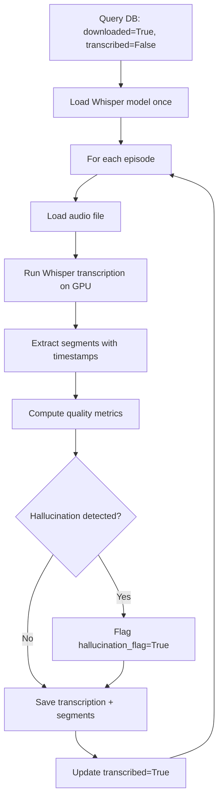

# Phase 2 Pipeline

## Overview

Phase 2 transcribes downloaded audio files into text with sentence-level
timestamps. Uses faster-whisper (CTranslate2 implementation of Whisper) for
GPU-accelerated inference. Each segment is stored with quality metrics for
later validation. Pipeline is idempotent — already-transcribed episodes
are skipped based on the database flag.

## Flow



## Components

| File | Responsibility |
|---|---|
| `src/transcription/transcriber.py` | Run Whisper inference and persist results |
| `src/transcription/validator.py` | Quality validation and reporting |

## Key Design Decisions

- **Model: large-v3 over medium:** medium lost 26s of audio after adding
  `initial_prompt`; large-v3 recovered all and improved proper noun accuracy
- **int8_float16 quantization:** Fits the model in 4GB VRAM with minimal
  quality impact
- **Permissive VAD/silence thresholds:** Prevents loss of segments with
  background music common in podcast intros
- **Per-segment persistence:** Each segment stored separately to support
  Phase 3 alignment with diarization timestamps
- **Quality flagging:** Episodes with `repetition_rate < 0.5` automatically
  flagged for review

## Configuration

| Parameter | Default | Where to configure |
|---|---|---|
| `WHISPER_MODEL` | large-v3 | `config/podcasts/{name}.py` |
| `WHISPER_LANGUAGE` | pt | `config/podcasts/{name}.py` |
| `WHISPER_INITIAL_PROMPT` | Custom prompt | `config/podcasts/{name}.py` |
| `WHISPER_BEAM_SIZE` | 5 | `src/transcription/config.py` |
| `WHISPER_VAD_FILTER` | False | `src/transcription/config.py` |
| `WHISPER_NO_SPEECH_THRESHOLD` | 0.8 | `src/transcription/config.py` |

See [REPLICATION_GUIDE.md](../REPLICATION_GUIDE.md).

## Language Considerations

- **Whisper has uneven multilingual quality.** Best on English, Spanish,
  French, Portuguese, German, Italian. Other languages may need fine-tuning
- **`initial_prompt` must be in the target language** and include domain
  terms (host names, jargon, English loanwords if applicable)
- **`language` parameter should be explicit** rather than auto-detected
- **Tokenizer behavior varies:** Some languages produce different segment
  boundaries, which affects downstream chunking

## Output

Database tables modified:

- `transcriptions` — one row per episode with full text and quality metrics
- `transcription_segments` — one row per Whisper segment with timestamps
  and per-segment metrics
- `episodes.transcribed` — flag updated to True when complete

## Quality Metrics Reference

The validator computes these metrics for each transcription. Use them to
identify episodes that may need re-processing or manual review.

### avg_logprob (Average Log Probability)

Average log probability of all segments. Represents the model's overall
confidence in the transcription.

| Range | Interpretation |
|---|---|
| > -0.2 | Excellent — model very confident |
| -0.2 to -0.4 | Good — reliable transcription |
| -0.4 to -0.7 | Acceptable — some uncertain segments |
| < -0.7 | Poor — low confidence, review recommended |

**Baseline:** -0.1381

### repetition_rate

Proportion of unique 50-word chunks relative to total chunks. Detects
hallucination loops where the model repeats the same phrase indefinitely.

| Range | Interpretation |
|---|---|
| 1.0 | Perfect — no repetition detected |
| 0.8 to 1.0 | Good — minor repetitions |
| 0.5 to 0.8 | Warning — significant repetition |
| < 0.5 | Critical — hallucination loop detected |

**Baseline:** 1.0
**Threshold:** Episodes with repetition_rate < 0.5 are automatically flagged
with `hallucination_flag = True`

### chars_per_minute

Number of transcribed characters per minute of audio. Used as a proxy for
coverage — episodes with very low values may have lost significant audio.

| Range | Interpretation |
|---|---|
| > 900 | Good — full coverage expected |
| 600 to 900 | Acceptable — minor gaps possible |
| 300 to 600 | Warning — significant gaps likely |
| < 300 | Poor — major content loss |

**Baseline:** 1070.2 chars/min (NerdCast 1026 reference episode)
**Note:** Music-heavy or intro/outro-heavy episodes naturally score lower

### language_confidence

Probability of the detected language, from 0.0 to 1.0. Low values indicate
the model had difficulty identifying the language, which can affect quality.

| Range | Interpretation |
|---|---|
| > 0.9 | Excellent — language clearly identified |
| 0.7 to 0.9 | Good — reliable detection |
| 0.5 to 0.7 | Warning — mixed language content |
| < 0.5 | Poor — language detection failed |

**Baseline:** 1.0

### hallucination_flag

Boolean flag set automatically when `repetition_rate < 0.5`. Flagged episodes
should be reviewed manually before being included in the RAG pipeline.

**Baseline:** False
**Action when True:** Delete transcription and reprocess with adjusted
parameters

## Running

```bash
# Test with one episode
python -c "from src.transcription.transcriber import run; run(max_episodes=1)"

# Full run
python -m src.transcription.transcriber

# Validate quality
python -m src.transcription.validator
```

## Troubleshooting

- **Out of memory:** Reduce `chunk_length` parameter or use a smaller model
- **Slow transcription:** Verify CUDA is actually being used (`device=cuda`)
- **Wrong language detected:** Set `language` parameter explicitly
- **Hallucination loops:** Lower `temperature` or adjust `compression_ratio_threshold`