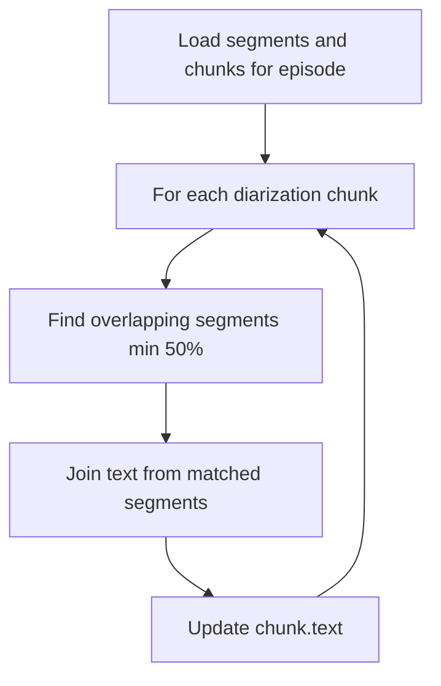

# Alignment Pipeline — Phase 3 Milestone 4

## Overview

Cross-references Whisper transcription segments with pyannote diarization chunks.
Fills the `chunk.text` field by aggregating text from overlapping transcription segments.

## Strategy

For each diarization chunk, find all transcription segments that overlap by at
least 50% of their duration. Join the text of matched segments separated by spaces.

## Flow



## Key Design Decisions

- **min_overlap_ratio: 0.5** — segments must overlap at least 50% with the chunk
  to avoid attributing partial speech to the wrong speaker
- **Idempotent** — running multiple times produces the same result
- **Independent of speaker name** — works with raw SPEAKER_XX labels

## Output

After alignment, chunks contain:
- start_time, end_time (from diarization)
- speaker label (from diarization)
- text (from transcription, joined by space)

This is the input format expected by the Phase 4 chunking pipeline.

## Running

```bash
# Test with 1 episode
python -c "from src.transcription.aligner import run; run(max_episodes=1)"

# Run on all aligned episodes
python -m src.transcription.aligner
```