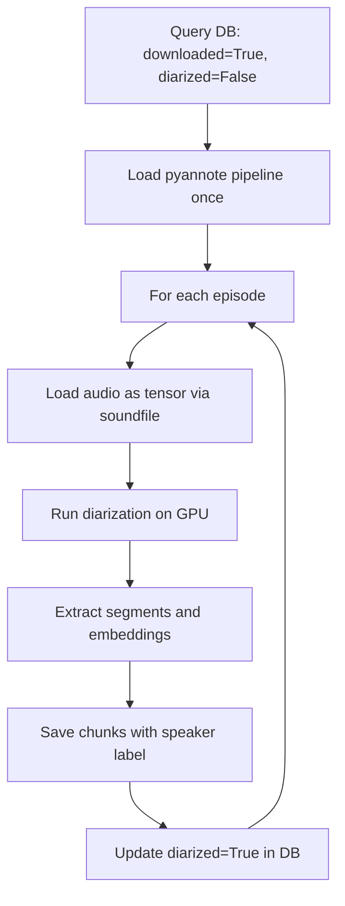

# Diarization Pipeline

## Overview

Runs speaker diarization on downloaded episodes using pyannote/audio 4.x.
Saves speaker segments to the chunks table for later alignment with transcription.
Idempotent: episodes already diarized are skipped based on database flag.

## Flow



## Key Design Decisions

- **soundfile for audio loading:** Bypasses torchcodec/FFmpeg dependency on Windows
- **skip_transcription_check flag:** Allows testing diarization independently
- **Chunks table:** Diarization segments saved as chunks — text will be added in Phase 4
- **Speaker embeddings:** Stored per episode for Phase 7 Speaker Identification

## Running

```bash
# Test with 1 episode
python -c "from src.transcription.diarizer import run; run(max_episodes=1)"

# Run on all transcribed episodes
python -m src.transcription.diarizer

# Run independently of transcription (for testing)
python -c "from src.transcription.diarizer import run; run(skip_transcription_check=True, max_episodes=1)"
```