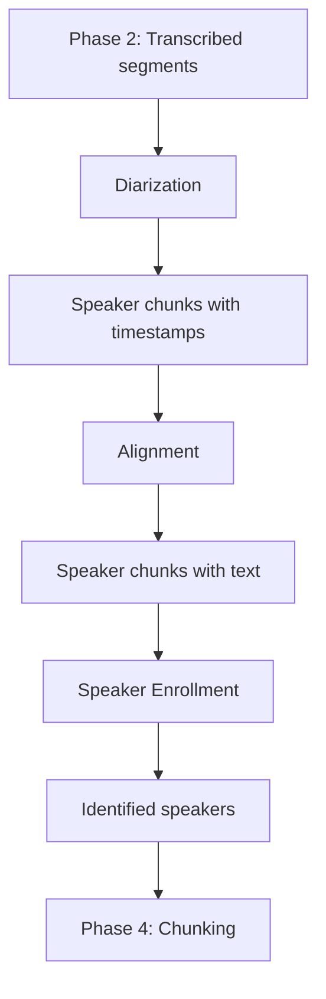

# Phase 3 Pipeline

## Overview

Phase 3 is composed of three sub-pipelines that work together to add the
speaker dimension to the transcribed audio: diarization (who speaks when),
alignment (matching speech to transcription), and enrollment (identifying
speakers by name).

## Flow



## Sub-pipelines

| Sub-pipeline | Doc | Purpose |
|---|---|---|
| Diarization | [subpipeline-diarization.md](./subpipeline-diarization.md) | Identify speaker turns from audio |
| Alignment | [subpipeline-alignment.md](./subpipeline-alignment.md) | Match speaker turns to transcription text |
| Enrollment | [subpipeline-enrollment.md](./subpipeline-enrollment.md) | Identify speakers by name via self-introduction |

## Components

| File | Responsibility |
|---|---|
| `src/transcription/diarizer.py` | Run pyannote diarization on episodes |
| `src/transcription/aligner.py` | Cross-reference Whisper segments with diarization chunks |
| `src/transcription/speaker_enrollment.py` | Identify hosts via self-introduction patterns |
| `src/transcription/diarization_validator.py` | Validate output quality across the phase |

## Key Design Decisions

- **Three independent sub-pipelines:** Each can be re-run independently.
  If diarization quality changes, alignment and enrollment automatically
  re-process on next run thanks to idempotency.
- **soundfile for audio loading:** Bypasses torchcodec/FFmpeg dependency on
  Windows. See `subpipeline-diarization.md` for details.
- **Self-introduction enrollment:** Avoids building a voice-print database
  upfront. See `subpipeline-enrollment.md`.

## Configuration

| Parameter | Default | Where to configure |
|---|---|---|
| `MAX_SPEAKERS_PER_EPISODE` | 8 | `config/podcasts/{name}.py` |
| `KNOWN_HOSTS` | NerdCast dict | `config/podcasts/{name}.py` |
| `INTRODUCTION_PATTERNS` | Portuguese | `config/podcasts/{name}.py` |
| `MIN_OVERLAP_RATIO` | 0.5 | `src/transcription/aligner.py` |

See [REPLICATION_GUIDE.md](../REPLICATION_GUIDE.md).

## Language Considerations

- **Diarization** is fully language-agnostic
- **Alignment** is language-agnostic (operates on timestamps)
- **Enrollment** requires language-specific regex patterns for self-introduction
  detection

When adapting to a new language, only the enrollment patterns and the
known hosts dictionary need updating.

## Output

Database tables modified:

- `chunks` — populated with `start_time`, `end_time`, `speaker` (raw label
  like SPEAKER_05), and `text` (after alignment)
- `speakers` — populated with identified speakers and their roles (host/guest)
- `speaker_embeddings` — voice embeddings per speaker per episode (for
  Phase 8 cross-episode consolidation)

## Running

```bash
# Run all three sub-pipelines in order
python -m src.transcription.diarizer
python -m src.transcription.aligner
python -m src.transcription.speaker_enrollment

# Validate the entire phase
python -m src.transcription.diarization_validator
```

## Troubleshooting

- **OOM during diarization:** Reduce batch size in `diarizer.py` or process
  shorter audio segments
- **Low alignment rate:** Check if transcription completed successfully —
  alignment requires both transcription and diarization data
- **Wrong speaker names:** Review `KNOWN_HOSTS` dictionary and introduction
  patterns in the podcast profile