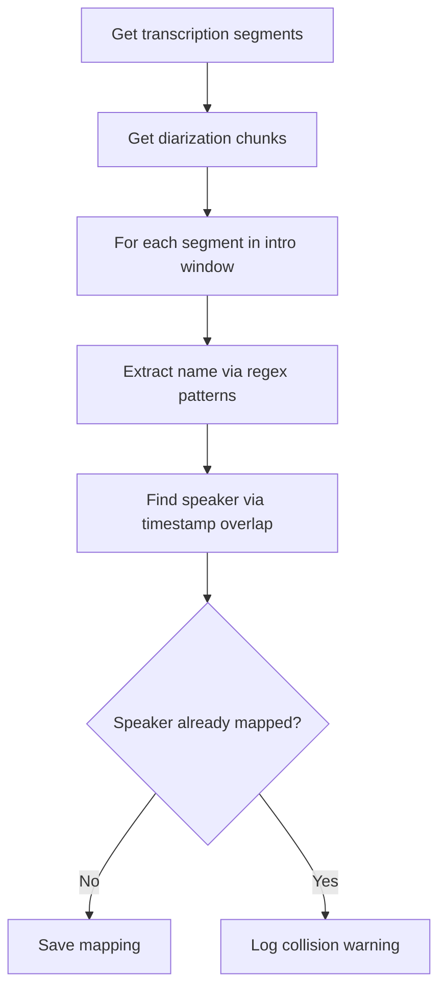

# Speaker Enrollment — Phase 3 Milestone 3

## Overview

Identifies speakers in podcast episodes by cross-referencing transcription
segments with diarization chunks. Extracts speaker names from self-introduction
phrases at the beginning of each episode.

## Strategy



## Components

### Name Extraction
Regex patterns detect self-introduction phrases:
- "aqui é o/a [NAME]"
- "eu sou [NAME]"
- "aqui quem vos fala é o/a [NAME]"

Known hosts are mapped via aliases (e.g., "alottoni" → "Alexandre Ottoni").

### Speaker Matching
Cross-references transcription timestamps with diarization chunks using:
1. **Maximum overlap** — primary matching strategy
2. **Nearest chunk** — fallback within 2-second tolerance

### Collision Handling
When the same diarization speaker is mapped to multiple names (e.g., due to
diarization grouping different voices), a warning is logged and the first
mapping is kept.

## Known Limitations

- Diarization may group different voices as the same speaker, causing collisions
- OOV proper nouns may not be extracted correctly
- Phase 8 will address collisions via progressive embedding consolidation

## Running

```bash
# Test with 1 episode
python -c "from src.transcription.speaker_enrollment import run; run(max_episodes=1)"

# Run on all transcribed and diarized episodes
python -m src.transcription.speaker_enrollment
```