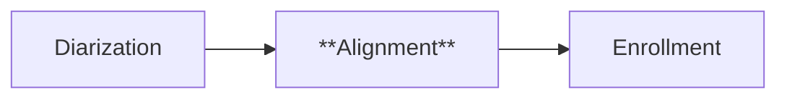
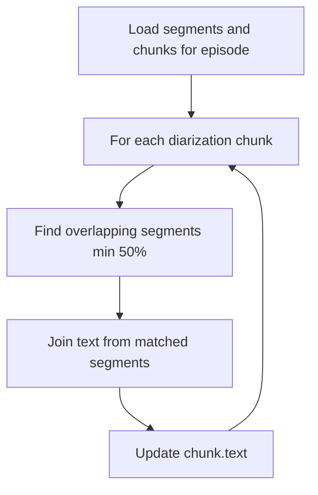

# Alignment — Phase 3 Subpipeline

## Purpose

Cross-reference Whisper transcription segments with pyannote diarization
chunks. Produces speaker-labeled chunks that contain both the speaker
identity (from diarization) and the spoken text (from transcription).

## Position in Phase



## Strategy

For each diarization chunk, find all transcription segments that overlap
by at least 50% of their duration. Join the text of matched segments
separated by spaces and store in the chunk's `text` field.

## Flow



## Key Design Decisions

- **min_overlap_ratio: 0.5** — segments must overlap at least 50% with the
  chunk to avoid attributing partial speech to the wrong speaker
- **Idempotent** — running multiple times produces the same result; safe
  to re-run after diarization or transcription changes
- **Independent of speaker identity** — operates with raw SPEAKER_XX labels;
  enrollment runs after alignment

## Configuration

| Parameter | Default | Notes |
|---|---|---|
| `min_overlap_ratio` | 0.5 | Minimum segment-chunk overlap to attribute text |

## Language Considerations

Fully language-agnostic. Operates only on timestamps and text strings,
without semantic interpretation.

## Output

Database changes:

- `chunks` table updated: `text` field populated for chunks that have
  overlapping transcription segments
- Chunks without overlapping segments retain `text=None` (typically very
  short chunks under 1 second)

## Known Limitations

- Chunks shorter than the minimum overlap threshold get no text
- Chunks where speech overlaps multiple speakers may attribute text to
  the wrong one (rare in practice but happens in lively conversations)

## Running

```bash
# Test with 1 episode
python -c "from src.transcription.aligner import run; run(max_episodes=1)"

# Run on all aligned episodes
python -m src.transcription.aligner
```