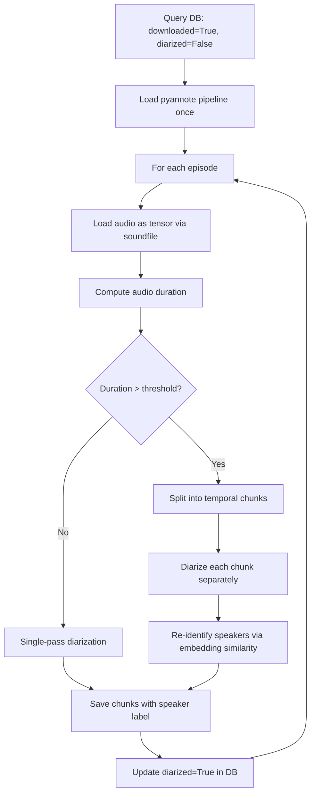

# Diarization — Phase 3 Subpipeline

## Purpose

Identify speaker turns within each episode's audio. Produces a sequence
of segments labeled with speaker identifiers (e.g., SPEAKER_00, SPEAKER_01)
that indicate who speaks at each moment, without yet knowing the actual
identity of those speakers.

## Position in Phase


## Strategy

The diarizer uses two strategies depending on episode length:

### Single-pass strategy (short episodes)

For episodes shorter than `LONG_EPISODE_THRESHOLD_SECONDS` (default 90 min),
the entire audio is processed in one pass by pyannote. This is the simplest
and highest-quality approach.

### Temporal chunking strategy (long episodes)

For longer episodes, single-pass diarization exceeds VRAM limits on 4GB
GPUs during final speaker embedding aggregation. The pipeline splits the
audio into overlapping temporal chunks (default 30 min with 30s overlap)
and processes each chunk separately. Speakers are then re-identified
across chunks via cosine similarity of their embeddings.

## Flow



## Speaker Re-identification

When using temporal chunking, each chunk produces local speaker labels
(SPEAKER_00, SPEAKER_01, ...). These labels are independent across chunks
— the same physical person may be labeled SPEAKER_01 in chunk 1 and
SPEAKER_03 in chunk 2.

To unify these labels, the pipeline:

1. Takes the first chunk's speakers as the initial global set
2. For each subsequent chunk, compares each local speaker's embedding to
   all known global speakers via cosine similarity
3. If similarity exceeds `REID_SIMILARITY_THRESHOLD` (default 0.75), the
   local speaker is mapped to the existing global label
4. Otherwise, a new global speaker is created

This approach maintains speaker consistency throughout a long episode
without requiring the full audio to fit in VRAM.

## Key Design Decisions

- **soundfile for audio loading:** Bypasses torchcodec/FFmpeg dependency
  on Windows
- **Pipeline-level batch size:** `embedding_batch_size=8` set as attribute
  on the pipeline (pyannote 4.x doesn't accept it as a kwarg)
- **Strategy selection by duration:** Audio duration is computed after
  loading the waveform, providing accurate length regardless of metadata
- **Overlap between chunks:** 30 seconds of overlap prevents speakers
  from being split at chunk boundaries
- **Cosine similarity threshold:** 0.75 chosen empirically as balance
  between false positives (different people merged) and false negatives
  (same person split into two)
- **Speaker embeddings stored:** Per-episode voice embeddings are saved
  for v2 cross-episode consolidation

## Configuration

| Parameter | Default | Notes |
|---|---|---|
| `DIARIZATION_MODEL` | pyannote/speaker-diarization-3.1 | Model version |
| `DIARIZATION_MIN_SPEAKERS` | 2 | Minimum speakers per chunk |
| `DIARIZATION_MAX_SPEAKERS` | 8 (podcast-specific) | Maximum speakers per chunk |
| `DIARIZATION_EMBEDDING_BATCH_SIZE` | 8 | Lower for less VRAM |
| `LONG_EPISODE_THRESHOLD_SECONDS` | 5400 | When to enable chunking (90 min) |
| `CHUNK_DURATION_SECONDS` | 1800 | Chunk size when chunking (30 min) |
| `CHUNK_OVERLAP_SECONDS` | 30 | Overlap between chunks |
| `REID_SIMILARITY_THRESHOLD` | 0.75 | Speaker matching threshold |

## Language Considerations

Fully language-agnostic. pyannote analyzes acoustic features (pitch,
timbre, rhythm) which are independent of the language being spoken.

## Output

Database changes:

- `chunks` table populated with one row per diarization segment containing:
  - `episode_id`, `start_time`, `end_time`
  - `speaker` (raw label like SPEAKER_00)
  - `text` is null at this point (filled by alignment)
- `speaker_embeddings` table populated with voice embeddings per speaker
- For chunked episodes: speaker labels are unified across chunks via
  re-identification

## Known Limitations

- Diarization may group different voices as the same speaker when
  acoustic characteristics are similar (similar pitch, similar background)
- Music and sound effects can confuse the segmentation
- For chunked episodes: speakers heard briefly only in one chunk may
  not be re-identified reliably due to limited embedding data
- The re-identification threshold may need tuning for podcasts with
  highly similar voices

## Running

```bash
# Test with 1 episode
python -c "from src.transcription.diarizer import run; run(max_episodes=1)"

# Run on all transcribed episodes
python -m src.transcription.diarizer

# Run independently of transcription (for testing)
python -c "from src.transcription.diarizer import run; run(skip_transcription_check=True, max_episodes=1)"
```