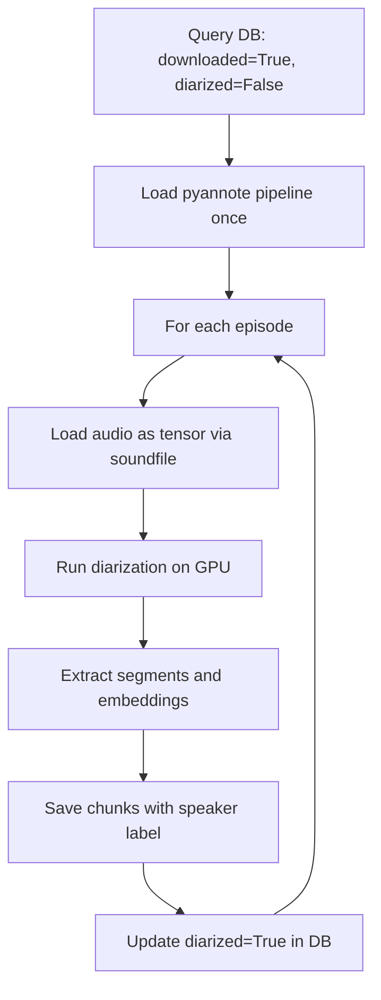

# Diarization — Phase 3 Subpipeline

## Purpose

Identify speaker turns within each episode's audio. Produces a sequence
of segments labeled with speaker identifiers (e.g., SPEAKER_00, SPEAKER_01)
that indicate who speaks at each moment, without yet knowing the actual
identity of those speakers.

## Position in Phase


## Strategy

Run pyannote/speaker-diarization-3.1 on each episode's audio. The model
performs voice activity detection, speaker embedding extraction, and
clustering to produce a sequence of speaker turns.

## Flow



## Key Design Decisions

- **soundfile for audio loading:** Bypasses torchcodec/FFmpeg dependency
  on Windows
- **skip_transcription_check flag:** Allows testing diarization independently
  of transcription completion (useful during development)
- **Chunks table reuse:** Diarization segments are saved as `chunks` records.
  Text is added later by the alignment sub-pipeline.
- **Speaker embeddings stored:** Per-episode voice embeddings are saved for
  Phase 8 cross-episode consolidation

## Configuration

| Parameter | Default | Notes |
|---|---|---|
| Model | pyannote/speaker-diarization-3.1 | Latest as of 2026-04 |
| Min speakers | 1 | Auto-detection works for any positive number |
| Max speakers | 8 | Configured per podcast |

## Language Considerations

Fully language-agnostic. pyannote analyzes acoustic features (pitch,
timbre, rhythm) which are independent of the language being spoken.

## Output

Database changes:

- `chunks` table populated with one row per diarization segment containing:
  - `episode_id`, `start_time`, `end_time`
  - `speaker` (raw label like SPEAKER_00)
  - `text` is null at this point (filled by alignment)
- `speaker_embeddings` table populated with voice embeddings per speaker

## Known Limitations

- Diarization may group different voices as the same speaker when
  acoustic characteristics are similar (similar pitch, similar background)
- Music and sound effects can confuse the segmentation
- Performance is fixed at ~6 min per episode on RTX 3050 Ti — does not
  scale with shorter audio

## Running

```bash
# Test with 1 episode
python -c "from src.transcription.diarizer import run; run(max_episodes=1)"

# Run on all transcribed episodes
python -m src.transcription.diarizer

# Run independently of transcription (for testing)
python -c "from src.transcription.diarizer import run; run(skip_transcription_check=True, max_episodes=1)"
```