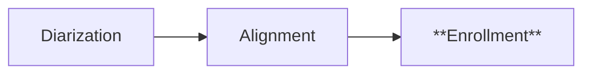
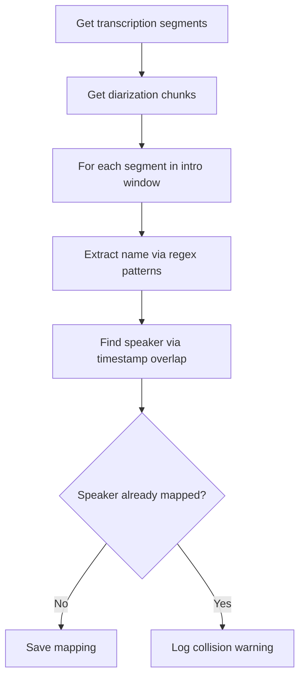

# Speaker Enrollment — Phase 3 Subpipeline

## Purpose

Identify the actual identities of diarization speakers (mapping SPEAKER_05
to "Alexandre Ottoni", for example) by parsing self-introduction phrases
in the opening minutes of each episode.

## Position in Phase



## Strategy

Most podcasts have hosts who introduce themselves at the beginning of each
episode. By matching transcription text against introduction patterns and
cross-referencing with diarization chunks, we can identify who corresponds
to each SPEAKER_XX label without prior voice samples.

## Flow



## Components

### Name Extraction

Regex patterns detect self-introduction phrases. For Portuguese:

- "aqui é o/a [NAME]"
- "eu sou [NAME]"
- "aqui quem vos fala é o/a [NAME]"

Known hosts are mapped via aliases (e.g., "alottoni" → "Alexandre Ottoni").

### Speaker Matching

Cross-references transcription timestamps with diarization chunks using:

1. **Maximum overlap** — primary matching strategy
2. **Nearest chunk** — fallback within 2-second tolerance

### Collision Handling

When the same diarization speaker is mapped to multiple names (e.g., due
to diarization grouping different voices as one speaker), a warning is
logged and the first mapping is kept.

## Configuration

| Parameter | Default | Notes |
|---|---|---|
| `INTRO_WINDOW_SECONDS` | 300 | First 5 minutes used for enrollment |
| `KNOWN_HOSTS` | NerdCast dict | Configured per podcast |
| `INTRODUCTION_PATTERNS` | Portuguese | Configured per language |

## Language Considerations

This is the most language-specific sub-pipeline. To adapt:

**English patterns:**
```python
INTRODUCTION_PATTERNS = [
    r"this is ([\w\s]+?)(?:,|\s+from|\s+and|$)",
    r"i'?m ([\w\s]+?)(?:,|\s+from|\s+and|$)",
    r"my name is ([\w\s]+?)(?:,|\s+from|\s+and|$)",
]
```

**Spanish patterns:**
```python
INTRODUCTION_PATTERNS = [
    r"aquí es ([\w\s]+?)(?:,|\s+y|$)",
    r"soy ([\w\s]+?)(?:,|\s+y|$)",
    r"me llamo ([\w\s]+?)(?:,|\s+y|$)",
]
```

## Output

Database changes:

- `speakers` table populated with identified speakers (name, role: host/guest)
- `chunks.speaker` may be updated with the canonical name (vs SPEAKER_XX)

## Known Limitations

- **OOV proper nouns:** Names not in the known hosts dictionary may not
  be extracted correctly
- **Speaker collisions:** When diarization groups voices, only one name
  is assigned; collisions are logged as warnings
- **Phase 8 improvements planned:** Cross-episode embedding consolidation
  to detect recurring speakers automatically

## Running

```bash
# Test with 1 episode
python -c "from src.transcription.speaker_enrollment import run; run(max_episodes=1)"

# Run on all transcribed and diarized episodes
python -m src.transcription.speaker_enrollment
```