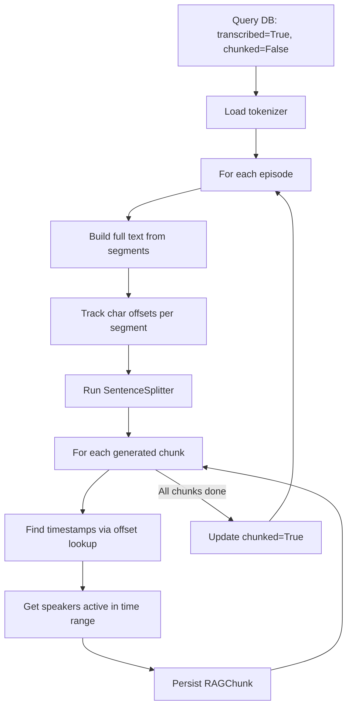

# Phase 4 Pipeline

## Overview

Phase 4 splits transcribed text into RAG-optimized chunks of ~500 tokens
each, with 50 tokens of overlap. Each chunk preserves timestamp and speaker
metadata for downstream citation. Idempotent: episodes already chunked
are skipped.

## Flow



## Components

| File | Responsibility |
|---|---|
| `src/processing/chunker.py` | Split text and persist chunks with metadata |
| `src/processing/validator.py` | Validate chunk quality across the corpus |

## Key Design Decisions

- **Recursive chunking via LlamaIndex SentenceSplitter** — balance between
  semantic coherence and deterministic size
- **Tokenizer: tiktoken cl100k_base** — industry standard for context measurement
- **Position-based timestamp lookup** — uses character offsets to correctly
  attribute timestamps even with chunk overlap
- **Speakers as metadata** — chunks are not split by speaker; speaker
  information attached as metadata only

## Configuration

| Parameter | Default | Notes |
|---|---|---|
| `CHUNK_SIZE` | 500 | Tokens per chunk |
| `CHUNK_OVERLAP` | 50 | 10% overlap to preserve context across boundaries |
| `OVERLAP_BUFFER_CHARS` | 500 | Buffer for finding chunk position in source text |

See [REPLICATION_GUIDE.md](../REPLICATION_GUIDE.md).

## Language Considerations

- **Tokenizer behavior varies by language.** cl100k_base is English-biased.
  Portuguese typically uses ~30% more tokens per character than English
- **For non-Latin scripts** (Chinese, Japanese, Korean, Arabic), consider
  SentencePiece or language-specific tokenizers
- **Sentence boundary detection** in SentenceSplitter handles common
  punctuation. Validate for new languages with unusual punctuation conventions

## Output

Database tables modified:

- `rag_chunks` — populated with text, token_count, timestamps, and speakers
  (JSON list of speaker labels active during the chunk's time range)
- `episodes.chunked` — flag updated to True when complete

The output of this phase is the input for Phase 5 vector indexing.

## Running

```bash
# Test with one episode
python -c "from src.processing.chunker import run; run(max_episodes=1)"

# Full chunking
python -m src.processing.chunker

# Validate
python -m src.processing.validator
```

## Troubleshooting

- **Chunks with `text=None`:** Usually very short diarization segments with
  no overlapping transcription. Expected behavior, not an error
- **Timestamps look wrong:** Verify the `overlap_buffer_chars` is large
  enough — for very long chunks, may need to increase
- **Token counts vary widely:** Check the language — non-English content
  tokenizes differently