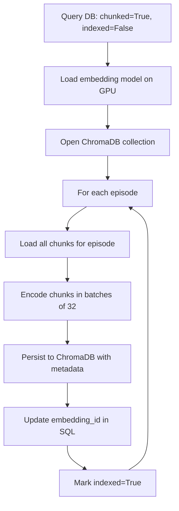

# Phase 5 Pipeline

## Overview

Phase 5 generates semantic embeddings for each chunk and stores them in
ChromaDB for fast similarity search. The pipeline maintains synchronization
between SQL (source of truth) and ChromaDB (search index). Idempotent —
already-indexed episodes are skipped.

## Flow



## Components

| File | Responsibility |
|---|---|
| `src/processing/indexer.py` | Generate embeddings and persist to ChromaDB |
| `src/processing/searcher.py` | Query interface for semantic search |
| `src/processing/indexing_validator.py` | Validate SQL ↔ ChromaDB consistency |

## Key Design Decisions

- **Multilingual embedding model:** `paraphrase-multilingual-mpnet-base-v2`
  supports 50+ languages with good quality
- **Cosine similarity:** Standard for text embeddings; isolates meaning
  from magnitude
- **HNSW indexing:** ChromaDB default; fast approximate nearest neighbors
  with ~99% recall vs exact search
- **Batch encoding (32):** Balances GPU utilization with VRAM constraints
- **Metadata in ChromaDB:** Pre-filter capability for queries (by episode,
  by speaker, by date)
- **embedding_id in SQL:** Traceability between SQL chunks and ChromaDB
  documents

## Configuration

| Parameter | Default | Notes |
|---|---|---|
| `EMBEDDING_MODEL` | mpnet-base-v2 | Multilingual, 768 dims |
| `BATCH_SIZE` | 32 | Optimal for 4GB VRAM |
| `DISTANCE_METRIC` | cosine | Standard for text |

See [REPLICATION_GUIDE.md](../REPLICATION_GUIDE.md).

## Language Considerations

- **Multilingual model handles 50+ languages** including all major European,
  East Asian, and Middle Eastern languages
- **For best quality per language,** consider language-specific models:
  - Portuguese: BERTimbau, Sabiá embeddings
  - Chinese: bge-m3, e5-large-zh
  - Multilingual with quality boost: bge-m3, e5-multilingual-large
- **Cross-language retrieval** works (query in Portuguese can find English
  content) but quality is lower than within-language search

## Output

ChromaDB collection populated with:

- `id` — formatted as `{episode_id}_{chunk_index}`
- `embedding` — 768-dim vector
- `document` — original chunk text
- `metadata` — episode_id, episode_title, start_time, end_time, speakers,
  token_count, published_at, duration_seconds

SQL `rag_chunks` table updated with `embedding_id` for traceability.

## Search API

```python
from src.processing.searcher import SemanticSearcher

searcher = SemanticSearcher()

# Basic search
results = searcher.search("missão Artemis", n_results=5)

# With episode filter
results = searcher.search(
    "missão Artemis",
    n_results=5,
    episode_id="abc123"
)

# With speaker filter
results = searcher.search(
    "exploração espacial",
    n_results=5,
    speaker="SPEAKER_05"
)
```

## Running

```bash
# Test with one episode
python -c "from src.processing.indexer import run; run(max_episodes=1)"

# Full indexing
python -m src.processing.indexer

# Interactive search
python -m src.processing.searcher

# Validate
python -m src.processing.indexing_validator
```

## Troubleshooting

- **Out of memory during encoding:** Reduce `batch_size` in indexer.py
- **ChromaDB count doesn't match SQL count:** Run validator to identify
  missing chunks; re-run indexer for affected episodes
- **Search returns irrelevant results:** Check `min_similarity` threshold
  in the searcher; consider re-ranking
- **Slow first query:** Embedding model takes 10-15s to load; subsequent
  queries are fast