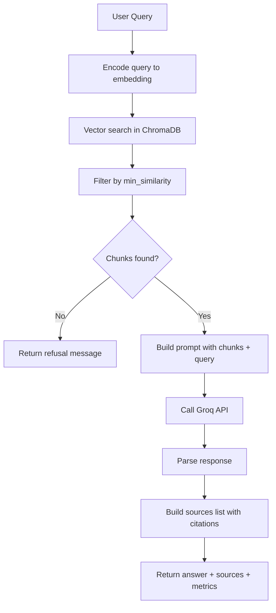

# Phase 6 Pipeline

## Overview

Phase 6 combines semantic search (Phase 5) with LLM generation to answer
questions about the podcast catalog. Each query goes through retrieval,
prompt construction, and generation in a single pipeline call. Includes
mandatory source citations and honest refusal when context is insufficient.

## Flow



## Components

| File | Responsibility |
|---|---|
| `src/rag/pipeline.py` | End-to-end RAG orchestration |
| `src/rag/prompts.py` | Prompt templates and citation formatting |
| `src/processing/searcher.py` | Vector search (from Phase 5) |
| `tests/evaluate_rag.py` | Batch evaluation runner |
| `tests/rag_evaluation_queries.py` | Golden dataset of test queries |

## Key Design Decisions

- **Source restriction in system prompt** — model uses only provided chunks
- **Mandatory citation format** — `[Trecho N, Ep: title, MM:SS]`
- **Honest refusal** — explicit instruction to say "not found" when context
  is insufficient, instead of inventing
- **Lower temperature (0.3)** — RAG doesn't need creativity; deterministic
  responses are preferred
- **Min similarity threshold** — filter low-quality matches before LLM call
- **Top-K = 5** — balance between context richness and prompt length

## Configuration

| Parameter | Default | Notes |
|---|---|---|
| `LLM_MODEL` | llama-3.3-70b-versatile | Groq's flagship model |
| `LLM_TEMPERATURE` | 0.3 | Low for determinism |
| `LLM_MAX_TOKENS` | 1024 | Sufficient for typical responses |
| `RAG_MIN_SIMILARITY` | 0.5 | Filter low-quality matches |
| `RAG_N_CHUNKS` | 5 | Standard for mid-size LLMs |

See [REPLICATION_GUIDE.md](../REPLICATION_GUIDE.md).

## Language Considerations

The system prompt and LLM choice are highly language-dependent:

- **System prompt language** should match the language of the corpus and
  desired response
- **LLM quality varies by language:**
  - Tier 1: English, Spanish, French
  - Tier 2: Portuguese, German, Italian, Chinese, Japanese
  - Tier 3: Most other languages — quality varies
- **Citation format strings** are language-specific:
  - Portuguese: "Trecho N, Ep: ..."
  - English: "Excerpt N, Ep: ..."
  - Spanish: "Fragmento N, Ep: ..."
- **Refusal messages** must be in the target language

When adapting to a new language, update:

1. `src/rag/prompts.py` — system prompt
2. Citation labels in `format_chunk_for_context()`
3. Refusal message in `build_no_results_response()`
4. Optionally, the LLM model if a language-specific model exists

## Output

Each `pipeline.answer(query)` call returns a dict:

```python
{
    "answer": "Generated response with citations...",
    "sources": [
        {"episode_title": "...", "time": "MM:SS", "similarity": 0.7},
        ...
    ],
    "chunks_used": 5,
    "model": "llama-3.3-70b-versatile",
    "tokens_used": 2706
}
```

## Running

```bash
# Interactive Q&A
python -m src.rag.pipeline

# Single query
python -c "
from src.rag.pipeline import RAGPipeline
p = RAGPipeline()
result = p.answer('Quais astronautas participaram da Artemis II?')
print(result['answer'])
"

# Run evaluation suite
python -m tests.evaluate_rag
```

## Troubleshooting

- **"GROQ_API_KEY not found":** Verify `.env` file contains the key
- **Slow first response:** Pipeline initializes embedding model on first
  query (~10s)
- **Empty answers:** Check `min_similarity` — may be too strict
- **Wrong language responses:** Check system prompt language matches the
  desired response language
- **Hallucinated citations:** Inspect prompt — system prompt must enforce
  citation format