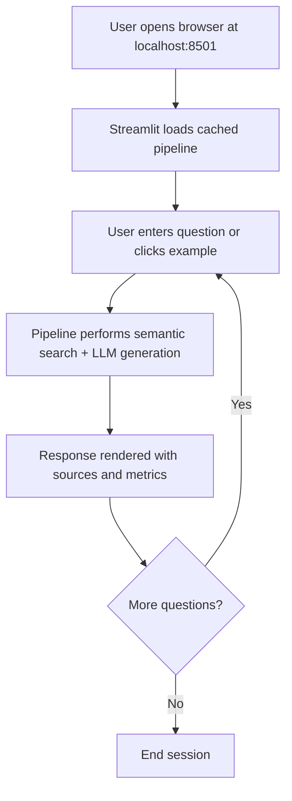

# Phase 7 Pipeline

## Overview

Phase 7 wraps the RAG pipeline (Phase 6) in a Streamlit web application.
It provides a chat-like interface where end users ask questions in natural
language and receive answers with cited sources from the podcast catalog.

## Flow



## Components

| File | Responsibility |
|---|---|
| `src/ui/app.py` | Streamlit application with chat interface |
| `src/rag/pipeline.py` | RAG pipeline (from Phase 6) |
| `src/processing/searcher.py` | Vector search (from Phase 5) |

## Key Design Decisions

- **Single file Streamlit app:** Keeps the MVP simple and easy to follow
- **Cached pipeline:** Pipeline loaded once via `@st.cache_resource`,
  shared across all sessions
- **Session-scoped state:** Conversation history lives in `st.session_state`,
  reset by closing the browser tab or clicking "New conversation"

## Features

- Natural language queries over the full podcast catalog
- Source citations with episode title and timestamp
- Color-coded similarity indicators (🟢🟡🔴)
- Expandable source cards with chunk text
- Session metrics (questions, tokens, time)
- Clickable example queries for discoverability
- "New conversation" button to reset state

## Out of Scope (for MVP)

- Speaker-aware queries (deferred until enrollment is refined)
- User accounts or persistent history
- Audio playback of cited segments
- Multi-page navigation
- Configuration UI for runtime parameters

## Configuration

| Parameter | Default | Where to configure |
|---|---|---|
| Page title | "{Podcast} Q&A" | `config/podcasts/{name}.py` |
| Example queries | 4 NerdCast queries | `config/podcasts/{name}.py` |
| Welcome message | Portuguese | `src/ui/translations/{lang}.py` |

See [REPLICATION_GUIDE.md](../REPLICATION_GUIDE.md).

## Language Considerations

All user-facing strings need translation:

- Page title and captions
- Button labels ("New conversation", etc.)
- Placeholder text in input field
- Welcome message and example queries
- Metric labels ("Tokens", "Time", "Questions")

The system prompt for the LLM (in `src/rag/prompts.py`) also needs to
match the language of the podcast content for best response quality.

## Output

The Streamlit app does not produce persistent output. All data lives
in session state and is lost when the browser tab closes.

## Running

```bash
# Activate virtual environment
.\venv\Scripts\Activate.ps1

# Start the application
streamlit run src/ui/app.py

# Open browser at http://localhost:8501
```

## Troubleshooting

- **Slow first load:** First-time pipeline load takes 25-30 seconds because
  the embedding model and ChromaDB need to initialize
- **Pipeline not responding:** Check that ChromaDB has indexed episodes
  (`python -m src.processing.indexing_validator`)
- **API errors from Groq:** Verify `GROQ_API_KEY` is set and valid